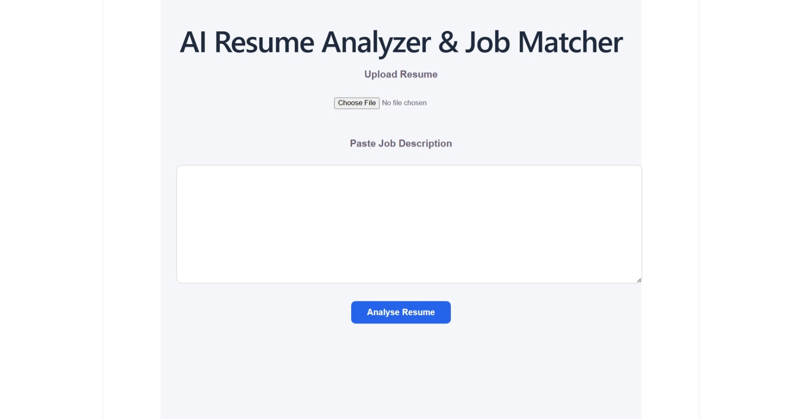
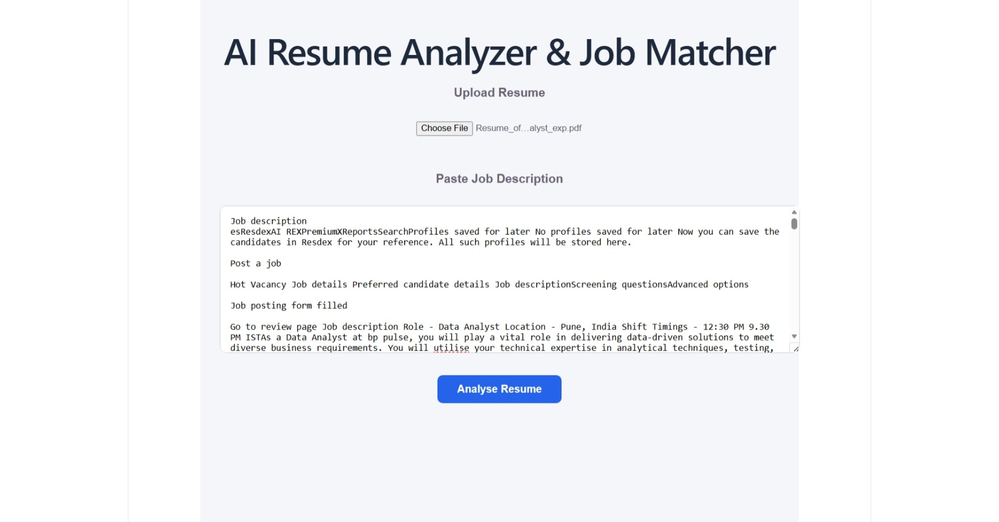
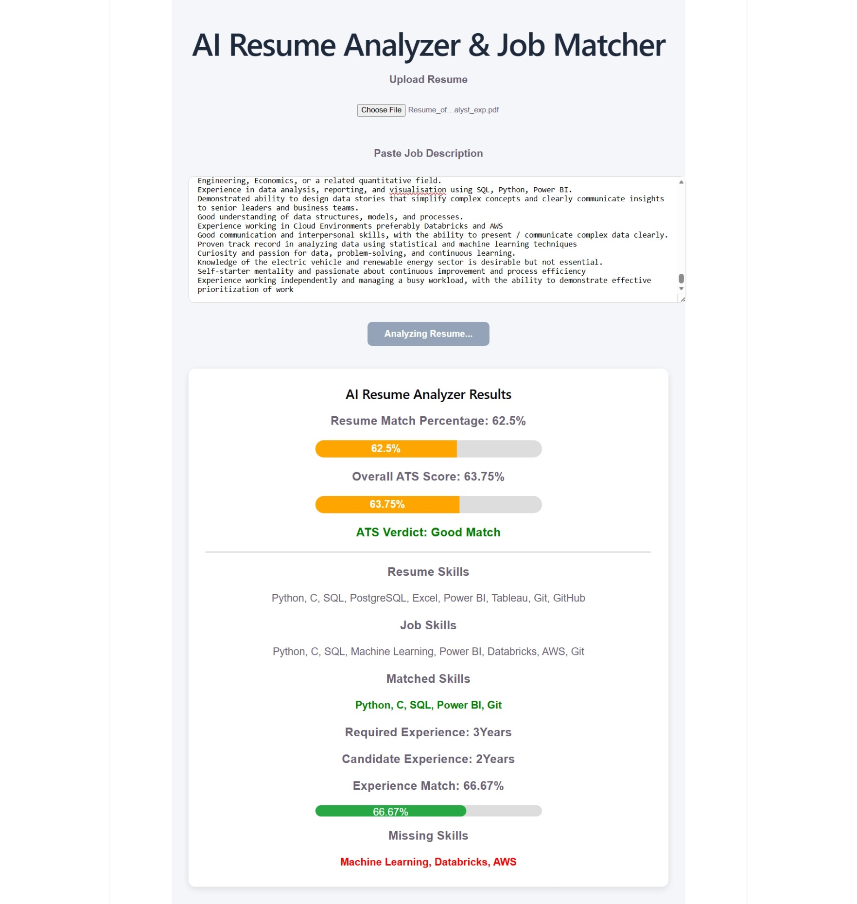

# AI Resume Analyzer & Job Matcher

An AI-powered Resume Analyzer that compares a candidate's resume with a Job Description (JD) and provides an ATS-style evaluation based on skills, experience, and overall job fit.

Built using React.js, Flask, Python, and PDF processing.


## Features

* Upload Resume (PDF)
* Paste Job Description
* Extract Resume Text Automatically
* Detect Technical Skills
* Compare Resume Skills with Job Skills
* Calculate Resume Match Percentage
* Calculate Experience Match Percentage
* Generate Overall ATS Score
* Display ATS Verdict
* Show Matched Skills
* Show Missing Skills
* Interactive Progress Bars


## Tech Stack

### Frontend

* React.js
* JavaScript
* HTML
* CSS

### Backend

* Flask
* Python
* Flask-CORS

### Libraries

* pdfplumber
* re (Regular Expressions)


## Project Architecture

```text
User Uploads Resume
        │
        ▼
React Frontend
        │
        ▼
Flask API
        │
        ▼
PDF Text Extraction
        │
        ▼
Skill Extraction
        │
        ▼
Experience Analysis
        │
        ▼
ATS Score Calculation
        │
        ▼
Results Displayed
```


## Screenshots

### Home Page


### Resume Analysis Result


## ATS Score Calculation

### Resume Match Percentage

```python
match_percentage = (
    len(matched_skills) /
    len(job_skills)
) * 100
```

### Experience Match

```python
experience_match = (
    candidate_experience /
    required_experience
) * 100
```

### Overall ATS Score

```python
overall_score = (
    match_percentage * 0.7 +
    experience_match * 0.3
)
```


## Sample Output

### Resume Skills

```text
Python
SQL
Power BI
Git
Excel
Tableau
```

### Job Skills

```text
Python
SQL
Machine Learning
Power BI
Databricks
AWS
Git
```

### Matched Skills

```text
Python
SQL
Power BI
Git
```

### Missing Skills

```text
Machine Learning
Databricks
AWS
```

### Output

```text
Resume Match Percentage : 62.5%

Experience Match : 66.67%

Overall ATS Score : 63.75%

ATS Verdict : Good Match
```

---

## Folder Structure

```text
AI-Resume-Analyzer
│
├── backend
│   ├── app.py
│   ├── uploads
│
├── frontend
│   ├── src
│   │   ├── App.jsx
│   │   ├── main.jsx
│
├── screenshots
│   ├── home.png
│   ├── results.png
│
├── README.md
```


## Installation

### Backend Setup

```bash
pip install flask
pip install flask-cors
pip install pdfplumber
```

Run Backend:

```bash
python app.py
```


### Frontend Setup

Install Dependencies:

```bash
npm install
```

Run React App:

```bash
npm run dev
```


## Future Enhancements

* Resume Recommendations
* AI-powered Resume Feedback
* Job Recommendation System


## Learning Outcomes

Through this project I gained hands-on experience in:

* React.js Frontend Development
* Flask Backend Development
* REST API Integration
* PDF Processing using Python
* Regular Expressions
* Skill Matching Algorithms
* ATS Score Calculation Logic
* Full Stack Application Development


## Screenshots

### Home Page



---

### Resume Upload



---

### Analysis Result




